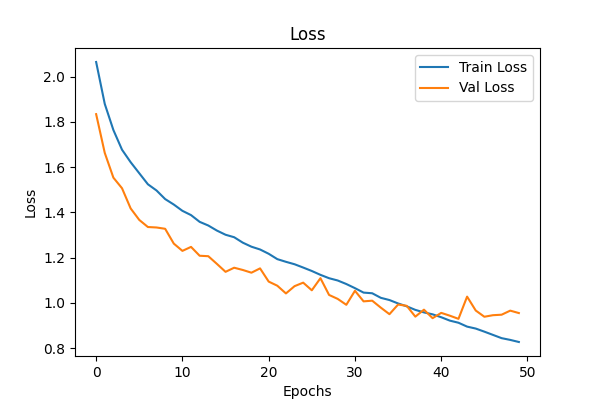

# Visual Attention Model

An implementation of Visual Attention model.  
[An Image is Worth 16x16 Words: Transformers for Image Recognition at Scale](https://arxiv.org/abs/2010.11929)

Comments have been added to the .ipynb code.

## Dataset
Three datasets have been used for experimenting : 
* MNIST : Digit recognition classification task
* [Cifar-10](https://www.cs.toronto.edu/~kriz/cifar.html) | [Download](https://www.cs.toronto.edu/~kriz/cifar-10-python.tar.gz) : Contains 10 classes for coloured imgaes
* [Cifar-100](https://www.cs.toronto.edu/~kriz/cifar.html)| [Download](https://www.cs.toronto.edu/~kriz/cifar-100-python.tar.gz)  : Contains 100 classes under the label 'fina label' for coloured imgaes

The uncompressed data goes into the data folder

## Data Augmentation
Initially I tried to train the model without and data augmentation, but the model quickly overfit to the training. 
Hence I added the following data augmentation for cifar-10 and cifar-100:
```
transformation = v2.Compose([v2.RandomResizedCrop(size=(32, 32), antialias=True),
                             v2.RandomHorizontalFlip(p=0.5)])
```

## Model 
I wanted to try writing the attention model from scratch but realised that nn.MultiheadAttention actually abstracts out a lot of the attention part of the model. 
```
self.self_attention = nn.MultiheadAttention(embedding_dim, num_heads, batch_first = True)
```
A few more important ideas that follows are : 
* Apart from the patches, a class token is appended which essentially is used as the final token that goes for the linear classification head
* Positional embedding essentially contains the relative position of the patches and is a randomized values instead of the traditional 2D sin and cos introduced in the actual attention paper. 

The model file is stored in the model/model.py

## Experimentation
For all the models, the following architecture parameter was follows :
* Patch Size : 4 x 4
* Number of transformer layer : 12
* Number of multi-head attention : 8
* Embedding dim : 256
* Linear Projection dim : 512

### MNIST
For MNIST dataset, I trained it for only 5 epochs since the loss and accuracy had already reached quite a good value.  
| Dataset | Loss |  Accuracy |
| -------------  |-------------  | ------------- |
| Train	| 0.05 | 0.98 | 
| Val	| 0.06 | 0.98 |
| Test  | 0.06 | 0.98 |

   

### Cifar-10
The data was split into train, test and val. Result for training on 50 epochs. 
| Dataset | Loss |  Accuracy |
| -------------  |-------------  | ------------- |
| Train	| 0.83 | 0.71 | 
| Val	| 0.85 | 0.69 |
| Test  | 0.93 | 0.69 |

  

### CIfar-100
For the Cifar-100 dataset, the validation and the test dataset were the same. Result for training on 25 epochs. 
| Dataset | Loss |  Accuracy |
| -------------  |-------------  | ------------- |
| Train	| 2.13 | 0.45 | 
| Val	| 2.37 | 0.41 |
| Test  | 2.37 | 0.41 |

  